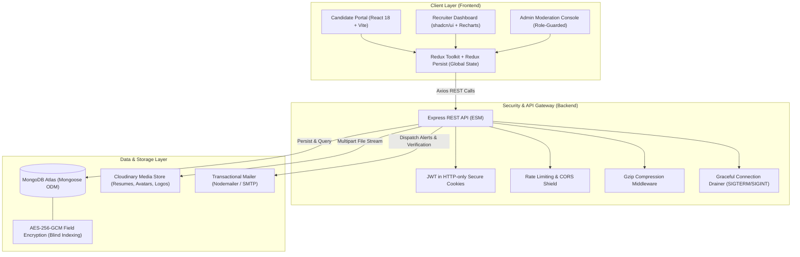

<div align="center">

# 💼 FOREWORK

### Next-Gen Enterprise MERN Stack Job Portal & Talent Acquisition Platform

An enterprise-ready, role-based job portal connecting **Job Seekers**, **Recruiters**, and **Platform Administrators**. Featuring military-grade PII encryption, real-time funnel analytics, PDF resume streaming, video interview scheduling, and automated audit logging.

<br/>

[](https://forework.vercel.app)
[](https://forework.onrender.com)
[](https://github.com/Jashan-randhawa/FOREWORK)
[](https://opensource.org/licenses/MIT)

<br/>

[](https://react.dev/)
[](https://vitejs.dev/)
[](https://redux-toolkit.js.org/)
[](https://tailwindcss.com/)
[](https://nodejs.org/)
[](https://expressjs.com/)
[](https://www.mongodb.com/)
[](https://www.docker.com/)
[](https://cloudinary.com/)

<br/>

[Explore Features](#-core-capabilities) • [System Architecture](#-system-architecture) • [API Specs](#-api-reference) • [Quick Start](#-quick-start) • [Documentation Hub](#-extended-documentation-hub)

</div>

---

## 🌟 Executive Summary

**FOREWORK** is an end-to-end recruitment ecosystem crafted with modern web engineering best practices. Built from the ground up on the **MERN (MongoDB, Express, React, Node.js)** stack, it solves common recruitment inefficiencies through three dedicated operational portals:

1. **Student / Job Seeker Hub**: Search and filter thousands of postings across 14 tech sectors, apply seamlessly with Cloudinary-backed PDF resumes, set custom periodic job alerts, track stage progress, and manage interview bookings.
2. **Recruiter Talent Suite**: Register verified corporate entities, publish granular job requisitions through a 5-stage lifecycle (`draft` → `published` → `paused` → `expired` → `closed`), screen candidates, review formatted CVs, schedule video calls with meeting links, and inspect interactive Recharts funnel analytics.
3. **Platform Administrator Center**: Full governance control over users, organizations, and listings, complete with suspension triggers, moderation queues, and an immutable forensic audit log trail.

---

## 🏛️ System Architecture



---

## ✨ Core Capabilities

### 👩‍💼 Candidate Experience
* **Smart Filter & Discovery Engine**: Real-time filtering by keyword, location (Delhi, Mumbai, Pune, Bangalore, Remote, etc.), technology stack, experience bands (0-3, 3-5, 5-7, 7+ yrs), and compensation ranges.
* **14-Domain Tech Carousel**: Direct navigation into specialized domains: *Frontend, Backend, Full Stack, MERN, Data Science, DevOps, Machine Learning, AI Engineering, Cybersecurity, Product Management, UI/UX, Graphics, and Media Editing*.
* **1-Click Application Flow**: Upload PDF resumes directly to Cloudinary with deduplication safeguards and rate-limit shields.
* **Real-Time Application Tracker**: Live status progression (`Pending` ➔ `Interview` ➔ `Accepted` / `Rejected`), synced with interview timetables and video links.
* **Personalized Job Alerts**: Automated alert subscriptions (daily/weekly frequencies) tailored to specific keywords and locations.
* **Bookmarks & Social Share**: 1-click bookmarks backed by unique compound database indexes and native Web Share API with clipboard fallback.

### 🏢 Recruiter & Talent Acquisition
* **Company Profile Management**: Register brand entities with official logos, verify enterprise credentials, and update headquarters details.
* **5-Stage Job Lifecycle Controller**: Complete administrative control over requisitions:
  $$\text{Draft} \longrightarrow \text{Published} \rightleftharpoons \text{Paused} \longrightarrow \text{Expired} \longrightarrow \text{Closed}$$
* **Funnel & Conversion Analytics**: Built-in Recharts visualizations tracking total listing views, applicant drop-off rates, conversion percentages, and candidate pipeline distribution.
* **Candidate Screening & Collaboration**: In-line resume viewer, private recruiter notes ledger per application, and direct status toggles.
* **Automated Interview Scheduler**: Schedule calendar dates and attach virtual meeting links with instant email dispatch to candidates.

### 🛡️ Enterprise Platform Governance
* **Volume Metrics & Growth Timelines**: 30-day growth trajectories, aggregate application volumes, and system-wide engagement metrics.
* **Moderation & Sanction Engine**: Paginated management views with immediate capability to suspend/reinstate users, approve/reject companies, and unpublish abusive job postings.
* **Forensic Audit Log Trail**: Immutable recording of every security-sensitive administrative event (`actor`, `action`, `targetType`, `targetId`, `timestamp`).

---

## 🔒 Hardened Security & Production Architecture

| Security Domain | Implementation | Security Benefit |
|-----------------|----------------|-------------------|
| **PII Data at Rest** | **AES-256-GCM** encryption with blind indexing | National IDs (PAN, Aadhaar) are stored ciphered; blind hash allows fast equality queries without exposing raw plaintext. |
| **Server Boot Guard** | `validateEnv.js` cryptographic key check | Refuses to launch in production if `FIELD_ENCRYPTION_KEY` is missing or matches example placeholders. |
| **Authentication** | JSON Web Tokens in `HttpOnly` Cookies | Zero access from JavaScript, protecting against Cross-Site Scripting (XSS) token theft. |
| **Transport Security** | `SameSite: Lax / None` + `Secure: true` | Defends against Cross-Site Request Forgery (CSRF) across deployments. |
| **Password Storage** | `bcryptjs` (Salt Rounds = 10) | Resilient defense against brute-force and dictionary attacks. |
| **Containerization** | Docker multi-stage build (Node 20 Alpine) | Ultra-lightweight footprint executed under an unprivileged `appuser` with integrated HTTP healthcheck. |
| **Reliability** | Graceful Termination Listeners | Drains pending HTTP requests and safely severs MongoDB connections upon receiving `SIGTERM` / `SIGINT`. |

---

## 🛠️ Complete Tech Stack

<div align="center">

| Tier | Technologies | Purpose |
| :--- | :--- | :--- |
| **Client UI** | **React 18**, Vite 6, React Router DOM v7 | Responsive single-page application with component lazy loading & suspense |
| **Design System** | **Tailwind CSS 3.4**, shadcn/ui, Radix UI | Accessible, clean modern UI primitives with dark/light themes |
| **Animations** | **Framer Motion 12**, Embla Carousel | Fluid layout transitions, smooth dialogs, and interactive category carousels |
| **State & Data** | **Redux Toolkit 2.5**, Redux Persist, Axios | Global client state caching with LocalStorage session persistence |
| **Charts** | **Recharts 2.x** | Interactive SVG candidate funnel charts and recruitment metrics |
| **Server Engine** | **Node.js 20**, Express 4.21 (ESM) | High-performance modular REST API runtime |
| **Database** | **MongoDB Atlas**, Mongoose 8.8 | Document database with compound indexing, blind indexing, and schemas |
| **Media & Files** | **Multer**, Cloudinary CDN, DataURI | In-memory buffer ingestion and instant Cloudinary asset transformation |
| **Messaging** | **Nodemailer** | Transactional email delivery for account verification and interview alerts |
| **Testing** | **Vitest** (10 test suites, 133 tests) | Comprehensive unit, security, and route integration tests |
| **DevOps** | **Docker**, GitHub Actions, Render, Vercel | Production containerization, automated CI pipelines, and cloud hosting |

</div>

---

## 🗄️ Database Schemas & Data Model

```
 ┌────────────────┐          ┌────────────────┐          ┌────────────────┐
 │     User       │ 1      * │    Company     │ 1      * │      Job       │
 ├────────────────┤──────────├────────────────┤──────────├────────────────┤
 │ _id            │          │ _id            │          │ _id            │
 │ fullname       │          │ name (unique)  │          │ title          │
 │ email (unique) │          │ description    │          │ description    │
 │ password(hash) │          │ website        │          │ requirements[] │
 │ role (enum)    │          │ location       │          │ salary         │
 │ pancard(enc)   │          │ logo (URL)     │          │ experienceLevel│
 │ adharcard(enc) │          │ isVerified     │          │ location       │
 │ isSuspended    │          │ userId (ref)   │          │ jobType        │
 │ profile {...}  │          └────────────────┘          │ status (enum)  │
 └───────┬────────┘                                      │ views (counter)│
         │ 1                                             │ company (ref)  │
         │                                               │ created_by(ref)│
         │ *                                             └───────┬────────┘
 ┌───────┴────────┐                                              │ 1
 │  Application   │ *                                            │
 ├────────────────┤──────────────────────────────────────────────┘
 │ _id            │
 │ job (ref)      │
 │ applicant(ref) │
 │ status (enum)  │  [pending | accepted | rejected | interview]
 │ recruiterNotes │
 │ scheduledAt    │
 │ meetingLink    │
 └────────────────┘
```

<details>
<summary><b>🔍 View Extended Model Specifications (SavedJob, JobAlert, Notification, AuditLog)</b></summary>

<br/>

* **SavedJob**: Compound index `{ user: 1, job: 1 }` prevents redundant bookmarking.
* **JobAlert**: Tracks `{ user, criteria: { keyword, location, minSalary, jobType }, frequency, lastSentAt }`.
* **Notification**: Stores `{ recipient, type, message, actionUrl, isRead }` with compound index `{ recipient: 1, isRead: 1, createdAt: -1 }`.
* **AuditLog**: Write-once security records `{ actor, action, targetType, targetId, details, ipAddress, timestamp }`.

</details>

---

## 📡 REST API Reference

Base URL (Production): `https://forework.onrender.com`

### 👤 Authentication & User Services (`/api/user`)
| Method | Route | Access | Purpose |
|:---:|:---|:---:|:---|
| `POST` | `/api/user/register` | Public | Account creation (PII encrypted, rate-limited) |
| `POST` | `/api/user/login` | Public | Authenticates credentials and sets HTTP-only JWT cookie |
| `POST` | `/api/user/logout` | Public | Clears authorization cookie |
| `POST` | `/api/user/profile/update` | 🔒 Authenticated | Updates bio, skills array, phone, and uploads resume PDF |
| `POST` | `/api/user/forgot-password` | Public | Dispatches anti-enumeration password reset link |
| `POST` | `/api/user/reset-password` | Public | Resets password with valid verification token |
| `GET` | `/api/user/verify-email` | Public | Verifies account email token |
| `POST` | `/api/user/verify-email/resend`| 🔒 Authenticated | Dispatches fresh verification token |

### 💼 Job Requisition Services (`/api/job`)
| Method | Route | Role | Purpose |
|:---:|:---|:---:|:---|
| `GET` | `/api/job/get` | Public | Search jobs with query filters (`keyword`, `location`, `salary`, `page`, etc.) |
| `GET` | `/api/job/get/:id` | Public | Fetch job details and atomically increment views counter |
| `POST` | `/api/job/post` | 🏢 Recruiter | Create a new job requisition |
| `GET` | `/api/job/getadminjobs` | 🏢 Recruiter | Fetch all jobs created by the authenticated recruiter |
| `PUT` | `/api/job/:id/status` | 🏢 Recruiter | Transition job status (`draft` / `published` / `paused` / `closed`) |
| `GET` | `/api/job/:id/stats` | 🏢 Recruiter | Get view-to-apply conversion funnel analytics |
| `POST` | `/api/job/:id/save` | 👩‍💼 Student | Bookmark a job to personal library |
| `DELETE`| `/api/job/:id/unsave` | 👩‍💼 Student | Remove a job bookmark |
| `GET` | `/api/job/saved` | 👩‍💼 Student | Retrieve candidate's saved listings |
| `POST` | `/api/job/alerts` | 👩‍💼 Student | Create recurring candidate job alert |

### 🏢 Organization Services (`/api/company`)
| Method | Route | Role | Purpose |
|:---:|:---|:---:|:---|
| `POST` | `/api/company/register` | 🏢 Recruiter | Register corporate identity and upload official logo |
| `GET` | `/api/company/get` | 🏢 Recruiter | List recruiter's registered companies |
| `GET` | `/api/company/get/:id` | 🏢 Recruiter | Retrieve single company details |
| `PUT` | `/api/company/update/:id`| 🏢 Recruiter | Update profile, logo, location, and website |

### 📝 Application & Interview Services (`/api/application`)
| Method | Route | Role | Purpose |
|:---:|:---|:---:|:---|
| `POST` | `/api/application/apply/:id` | 👩‍💼 Student | Submit application with stored resume |
| `GET` | `/api/application/get` | 👩‍💼 Student | Retrieve candidate's applied jobs with live statuses |
| `GET` | `/api/application/:id/applicants`| 🏢 Recruiter | Review all submissions for a job |
| `POST` | `/api/application/status/:id/update`| 🏢 Recruiter | Update candidate status (`Accepted`, `Rejected`, `Interview`) |
| `POST` | `/api/application/:id/notes` | 🏢 Recruiter | Append private screening note |
| `POST` | `/api/application/:id/schedule` | 🏢 Recruiter | Schedule video interview and dispatch email notification |

### 🛡️ Admin & Governance Services (`/api/admin`)
| Method | Route | Role | Purpose |
|:---:|:---|:---:|:---|
| `GET` | `/api/admin/stats` | 🛡️ Admin | Platform-wide growth figures and role aggregates |
| `PATCH`| `/api/admin/users/:id/status` | 🛡️ Admin | Suspend or reactivate user account |
| `PATCH`| `/api/admin/jobs/:id` | 🛡️ Admin | Moderate job requisition state |
| `PATCH`| `/api/admin/companies/:id/verify` | 🛡️ Admin | Grant verified corporate checkmark |
| `GET` | `/api/admin/audit-logs` | 🛡️ Admin | Query forensic immutable audit trail |

---

## 🗺️ Client Route Hierarchy

```
/ (Home) ─────────────────────────► Landing page, hero search, category carousel, top jobs
├── /Jobs ────────────────────────► Paginated search catalogue with live filter sidebar
├── /Browse ──────────────────────► Quick keyword query explorer
├── /description/:id ─────────────► Full posting breakdown, requirements, 1-click apply
├── /login & /register ───────────► Role-specific authentication with avatar upload
├── /Profile ─────────────────────► Candidate portfolio, skills manager, resume uploader
├── /saved-jobs ──────────────────► Candidate bookmark collection (Protected)
│
├── Recruiter Portal (Protected)
│   ├── /recruiter/companies ─────► Organization profiles
│   ├── /recruiter/jobs ──────────► Listing manager & status switcher
│   ├── /recruiter/jobs/create ───► Multi-parameter job requisition builder
│   └── /recruiter/jobs/:id/applicants ► Review candidates, notes & interview scheduling
│
└── Admin Console (Protected)
    ├── /admin/dashboard ─────────► High-level platform KPIs & growth analytics
    ├── /admin/users ─────────────► User governance & suspension controls
    ├── /admin/jobs ──────────────► Listing moderation
    ├── /admin/companies ─────────► Corporate verification
    └── /admin/audit-logs ────────► Real-time security event inspector
```

---

## 🚀 Quick Start

### Prerequisites
* **Node.js** >= 18.0.0
* **npm** >= 9.0.0
* **MongoDB** (Local or MongoDB Atlas cluster)
* **Cloudinary** Account (Free tier)
* **OpenSSL** (for key generation)

### 1️⃣ Clone the Repository
```bash
git clone https://github.com/Jashan-randhawa/FOREWORK.git
cd FOREWORK
```

### 2️⃣ Backend Configuration & Launch
```bash
cd Backend

# Copy example environment configuration
cp .env.example .env

# Generate high-entropy 32-byte hexadecimal encryption key
openssl rand -hex 32
# Paste output into FIELD_ENCRYPTION_KEY inside .env

npm install
npm run dev        # Development mode with Nodemon on http://localhost:5001
```

### 3️⃣ Frontend Configuration & Launch
```bash
# In a new terminal tab
cd Frontend

# Configure API endpoint
echo "VITE_API_URL=http://localhost:5001" > .env

npm install
npm run dev        # Development server on http://localhost:5173
```

---

## 🐳 Docker Deployment

The repository includes a production-ready, security-hardened **multi-stage Dockerfile** utilizing Alpine Linux and unprivileged system execution.

```bash
# 1. Build optimized production image
docker build -t forework-backend .

# 2. Run container with environment bindings
docker run -d -p 5001:5001 \
  --name forework-api \
  -e MONGO_URI="mongodb+srv://<user>:<password>@cluster.mongodb.net/forework" \
  -e JWT_SECRET="your-super-strong-jwt-secret" \
  -e FIELD_ENCRYPTION_KEY="$(openssl rand -hex 32)" \
  -e CLOUD_NAME="your-cloudinary-name" \
  -e CLOUD_API="your-cloudinary-api-key" \
  -e API_SECRET="your-cloudinary-api-secret" \
  -e FRONTEND_URL="http://localhost:5173" \
  -e EMAIL_USER="your-email@gmail.com" \
  -e EMAIL_PASS="your-smtp-app-password" \
  forework-backend
```

---

## ⚙️ Environment Configuration

### Backend (`Backend/.env`)
| Variable | Mandatory | Default | Purpose |
|:---|:---:|:---:|:---|
| `MONGO_URI` | ✅ | — | MongoDB Atlas connection string |
| `JWT_SECRET` | ✅ | — | Secret key used to sign and verify JSON Web Tokens |
| `PORT` | ❌ | `5001` | Server listening port |
| `FIELD_ENCRYPTION_KEY` | ✅ | — | 64-char hex key (32 bytes) for AES-256-GCM. *Server halts if missing!* |
| `CLOUD_NAME` | ✅ | — | Cloudinary cloud namespace |
| `CLOUD_API` | ✅ | — | Cloudinary API Key |
| `API_SECRET` | ✅ | — | Cloudinary API Secret |
| `FRONTEND_URL` | ✅ | `http://localhost:5173` | Allowed origin for CORS headers |
| `EMAIL_USER` | ✅ | — | SMTP mailbox address for notifications |
| `EMAIL_PASS` | ✅ | — | SMTP app-specific password |

### Frontend (`Frontend/.env`)
| Variable | Mandatory | Purpose |
|:---|:---:|:---|
| `VITE_API_URL` | ✅ | Base URI to backend server (`https://forework.onrender.com` or `http://localhost:5001`) |

---

## 🧪 Automated Testing & Verification

FOREWORK adheres to rigorous automated testing standards across its service logic, authorization guards, and encryption routines.

```bash
cd Backend
npm test
```

```
 ✓ tests/phase1-auth.test.js (16 tests)
 ✓ tests/phase2-jobs.test.js (18 tests)
 ✓ tests/phase3-companies.test.js (12 tests)
 ✓ tests/phase4-applications.test.js (15 tests)
 ✓ tests/phase5-admin.test.js (14 tests)
 ✓ tests/phase6-security-crypto.test.js (15 tests)
 ✓ tests/phase7-notifications.test.js (11 tests)
 ✓ tests/phase8-analytics.test.js (10 tests)
 ✓ tests/phase9-a11y-errorboundary.test.js (10 tests)
 ✓ tests/phase10-e2e-workflows.test.js (12 tests)

Test Files  10 passed (10)
     Tests  133 passed (133)
  Duration  4.18s
```

---

## 🔑 Demo Sandbox Credentials

Want to test the platform without registering new accounts? Use the pre-configured credentials below:

| Portal Persona | Email Address | Password | Privileges |
|:---|:---|:---:|:---|
| **Job Seeker (Candidate)** | `jashan@gmail.com` | `password123` | Search, bookmark, apply, upload resume, view tracker |
| **Corporate Recruiter** | `recruiter@company.com` | `password123` | Post jobs, update status, screen resumes, schedule calls |

---

## 📚 Extended Documentation Hub

For deep architectural analyses and implementation specifics, explore the comprehensive guides within [`/docs`](./docs):

| Section | Documentation Guides |
|:---|:---|
| **Architectural Design** | • [Security & Encryption Architecture](./docs/architecture/security.md)<br/>• [Database Schema Design & Indexing](./docs/architecture/database.md) |
| **Candidate Experience** | • [Job Search & Filtering](./docs/features/jobs.md)<br/>• [Candidate Workflow & Applications](./docs/features/candidate-experience.md) |
| **Employer Experience**| • [Company Governance & Hiring](./docs/features/employer-experience.md)<br/>• [Funnel Analytics Engine](./docs/features/analytics.md) |
| **Security & Governance**| • [Authentication & Roles](./docs/features/authentication.md)<br/>• [Administration & Audit Trail](./docs/features/administration.md)<br/>• [Security, Performance & Accessibility](./docs/features/security-performance-a11y.md) |
| **Deployment & Ops** | • [Docker & Production Deployment](./docs/deployment/docker-and-production.md)<br/>• [Role Authorization Guide](./docs/api/authorization.md) |

---

## 🤝 Contributing

Contributions make the open-source community an inspiring place to learn, inspire, and create. Any contributions you make are **greatly appreciated**.

1. **Fork** the Project
2. Create your Feature Branch: `git checkout -b feat/amazing-feature`
3. Commit your Changes: `git commit -m "feat: implement amazing feature"`
4. Push to the Branch: `git push origin feat/amazing-feature`
5. Open a **Pull Request**

---

## 👨‍💻 Creator & Maintainer

<div align="center">

### **Jashanpreet Singh**
*Full Stack Developer & Systems Architect*

[](https://github.com/Jashan-randhawa)
[](https://forework.vercel.app)

</div>

---

## 📄 License

Distributed under the **MIT License**. See [`LICENSE`](./LICENSE) for more information.

<div align="center">
<sub>Engineered with precision for modern hiring teams and ambitious talent.</sub>
</div>
