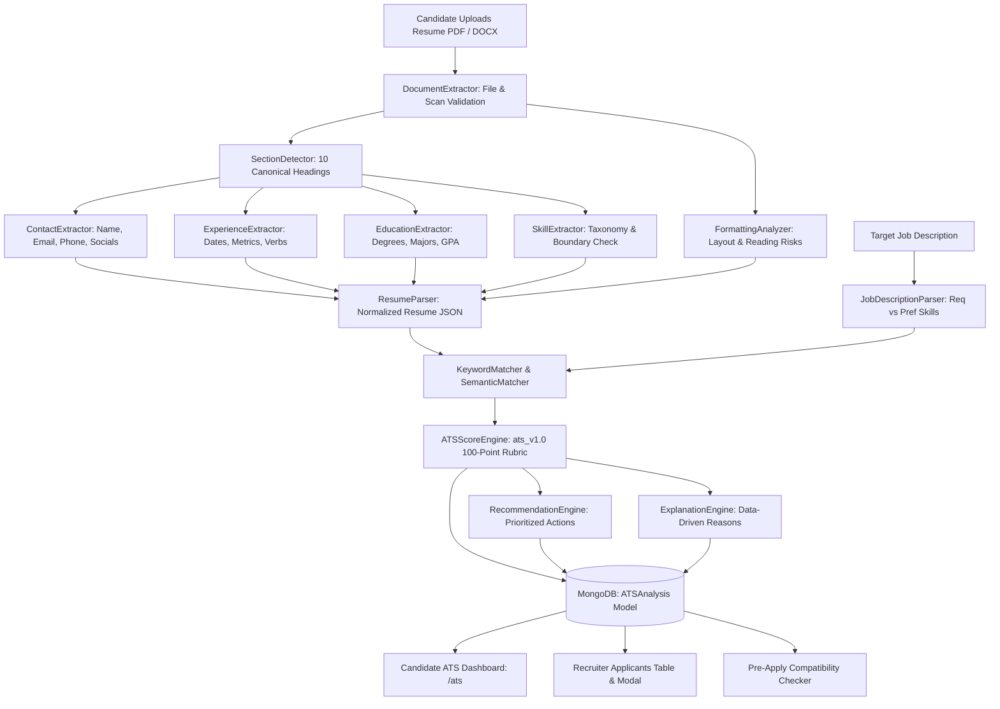

# 🎯 ATS Resume Analyzer & Job Match Predictor

## Executive Summary
The **FOREWORK ATS Predictor** is an explainable Applicant Tracking System (ATS) compatibility engine integrated directly into FOREWORK. It deterministically analyzes resume documents (PDF, DOCX, and TXT) across parseability, structure, content evidence, and job-specific alignment. In v2.1, the engine also powers a **Pre-Apply Compatibility Checker** embedded directly in job detail pages, and supports **authenticated Cloudinary resume downloads** for seamless profile-based analysis.

---

## 🧭 Core Metrics

The system calculates two distinct, non-arbitrary scores:

1. **ATS Compatibility Score (0–100)**: Evaluates machine readability, reading order, contact completeness, standard heading detection, and formatting risk factors.
2. **Job Match Score (0–100)**: Evaluates semantic and keyword alignment against a specific job posting, weighting required skills (75%) significantly higher than preferred skills (25%).

> **Optimization Notice**: FOREWORK explicitly presents these scores as **optimization indicators** rather than hiring guarantees, explaining that commercial ATS engines differ between vendors.

---

## ⚙️ Architecture & Pipeline Flow

---

## 📊 100-Point Scoring Rubric (`ats_v1.0`)

| Metric | Max Pts | Focus Areas |
| :--- | :---: | :--- |
| **Parseability** | **20** | Machine-readable text, clean encoding, contact detection, layout safety |
| **Job Alignment** | **30** | Required skills coverage (75%), preferred skills coverage (25%), semantic boost |
| **Experience Relevance** | **20** | Years of experience vs required, role titles, responsibility alignment, metrics |
| **Structure** | **10** | Standard section headers, chronological progression, completeness |
| **Qualifications** | **10** | Verified degrees (Ph.D., Master's, Bachelor's) and certifications |
| **Evidence & Quality** | **10** | Action verbs ($\ge 5$), quantifiable achievements ($\ge 3$), bullet conciseness |
| **TOTAL** | **100** | Full deterministic ATS evaluation score |

### Mathematical Formulations

**ATS Compatibility Score (0–100)**:
$$\text{ATS Compatibility} = \min\left(100, (\text{Parsing} \times 2.5) + (\text{Structure} \times 2.0) + (\text{Quality} \times 1.5) + (\text{Completeness} \times 0.5)\right)$$

**Job Match Score (0–100)**:
$$\text{Job Match} = \min\left(100, (\text{Alignment} \times 2.0) + (\text{Experience} \times 1.25) + (\text{Qualifications} \times 1.5)\right)$$

**Job Alignment Score (Max: 30 pts)**:
$$\text{Alignment} = (\text{RequiredRatio} \times 22.5) + (\text{PreferredRatio} \times 7.5) + \text{SemanticBoost}_{(\max 4.5)}$$

---

## 🔎 Pre-Apply Compatibility Checker (`JobDetailATSCheck.jsx`)

> **New in v2.1**: Candidates can now check their resume compatibility against a specific job posting **before submitting their application**, directly from the job detail page.

### User Flow
1. **Source Selection**: Toggle between "My Profile Resume" (Cloudinary-stored) or "Upload Local File" (drag-and-drop).
2. **One-Click Analysis**: Sends resume + `job_id` to `POST /api/ats/analyze` for dual scoring.
3. **Inline Results**: Displays Job Match Score, ATS Parseability score, and Match Health summary within the job detail card.
4. **Skills Alignment**: Visual badge breakdown of ✓ Matched, ✗ Missing Required, and + Missing Preferred skills.
5. **Actionable Tips**: Top 2 prioritized recommendations shown before the "Proceed to Apply Now" button.
6. **Transparent Explanation**: "Why is my score X/100?" dialog with category-level breakdown reasons.

### Recruiter View
Recruiters see an "ATS Insights Available" banner directing them to the Applicants Management table where per-candidate ATS breakdowns are accessible via `ATSAnalysisModal`.

### Graceful Fallback
If a profile resume stored on Cloudinary returns a storage permission error (401/403), the component automatically switches to direct file upload mode with a user-friendly guidance toast.

---

## 🛠️ API Reference

### 1. `POST /api/ats/analyze`
Accepts `multipart/form-data` with `file` (`.pdf`, `.docx`, `.txt`) or JSON with stored `use_profile_resume: true` / `resume_url`, along with optional `job_id` or `job_description`.
Returns overall score, dual score breakdown, matched/missing skills, formatting warnings, and prioritized recommendations.

**Authenticated Cloudinary Downloads**: When `use_profile_resume: true` is specified, the backend fetches the user's Cloudinary-hosted resume using authenticated download with proper headers, supporting private/restricted Cloudinary resources.

### 2. `POST /api/ats/score`
Lightweight compatibility scoring endpoint returning normalized score (0.0–1.0) and match details.

### 3. `GET /api/ats/history`
Retrieves past ATS scans for the authenticated candidate.

### 4. `GET /api/ats/analysis/:id`
Retrieves a specific saved ATS analysis by MongoDB ObjectId.

### 5. `GET /api/ats/application/:appId`
Recruiter endpoint retrieving or computing on-the-fly candidate ATS breakdown for an application.

---

## 🧩 Frontend Component Architecture

| Component | Purpose |
| :--- | :--- |
| `ATSAnalysis.jsx` (page) | Full-page ATS diagnostic studio with upload, dual gauges, history, and detailed breakdowns |
| `JobDetailATSCheck.jsx` | Pre-apply compatibility checker embedded in job detail pages |
| `ATSScore.jsx` | Animated circular gauge component with score-based color theming |
| `ScoreBreakdown.jsx` | 6-category score visualization with animated progress bars |
| `SkillMatch.jsx` | Filterable pill-based matched/missing skill comparison |
| `FormattingIssues.jsx` | Severity-coded formatting risk cards |
| `Recommendations.jsx` | Prioritized action items with category and priority badges |
| `ATSExplanation.jsx` | Modal dialog explaining "Why is my score X?" |
| `ATSAnalysisModal.jsx` | Recruiter modal for viewing per-candidate ATS breakdowns |

---

## 🔒 Fairness & PII Security
- **No Protected Attributes**: The algorithm ignores age, gender, race, religion, photos, and personal demographics.
- **In-Memory Buffering**: Uploaded files are parsed directly in RAM without saving raw text to unencrypted local disk caches.
- **Anti-Stuffing Guarantee**: The recommendation engine emphasizes truthful, evidence-based descriptions and never encourages keyword stuffing or false claims.
- **Tracking Prevention Compliance**: Service worker ATS API requests bypass cache to prevent browser tracking prevention from blocking analysis requests.
