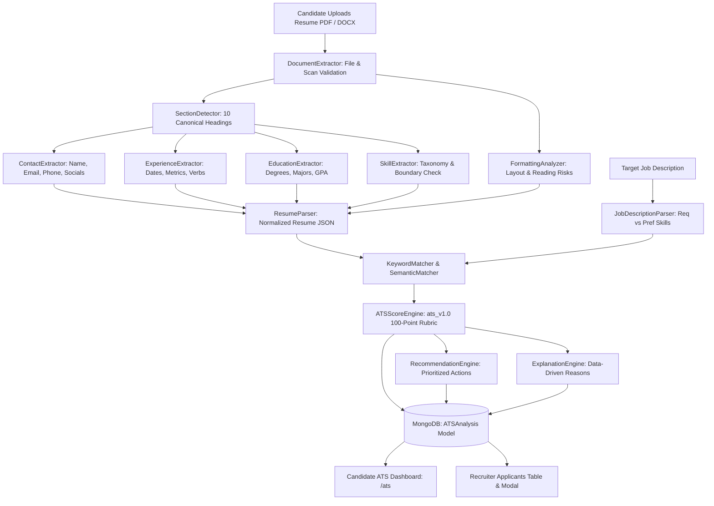

# 🎯 ATS Resume Analyzer & Job Match Predictor

## Executive Summary
The **FOREWORK ATS Predictor** is an explainable Applicant Tracking System (ATS) compatibility engine integrated directly into FOREWORK. It deterministically analyzes resume documents (PDF, DOCX, and TXT) across parseability, structure, content evidence, and job-specific alignment.

---

## 🧭 Core Metrics

The system calculates two distinct, non-arbitrary scores:

1. **ATS Compatibility Score (0–100)**: Evaluates machine readability, reading order, contact completeness, standard heading detection, and formatting risk factors.
2. **Job Match Score (0–100)**: Evaluates semantic and keyword alignment against a specific job posting, weighting required skills (75%) significantly higher than preferred skills (25%).

> **Optimization Notice**: FOREWORK explicitly presents these scores as **optimization indicators** rather than hiring guarantees, explaining that commercial ATS engines differ between vendors.

---

## ⚙️ Architecture & Pipeline Flow

---

## 📊 100-Point Scoring Rubric (`ats_v1.0`)

| Metric | Max Pts | Focus Areas |
| :--- | :---: | :--- |
| **Parseability** | **20** | Machine-readable text, clean encoding, contact detection, layout safety |
| **Job Alignment** | **30** | Required skills coverage (75%), preferred skills coverage (25%), semantic boost |
| **Experience Relevance** | **20** | Years of experience vs required, role titles, responsibility alignment, metrics |
| **Structure** | **10** | Standard section headers, chronological progression, completeness |
| **Qualifications** | **10** | Verified degrees (Ph.D., Master's, Bachelor's) and certifications |
| **Evidence & Quality** | **10** | Action verbs ($\ge 5$), quantifiable achievements ($\ge 3$), bullet conciseness |
| **TOTAL** | **100** | Full deterministic ATS evaluation score |

---

## 🛠️ API Reference

### 1. `POST /api/ats/analyze`
Accepts `multipart/form-data` with `file` (`.pdf`, `.docx`, `.txt`) or JSON with stored `use_profile_resume: true` / `resume_url`, along with optional `job_id` or `job_description`.
Returns overall score, dual score breakdown, matched/missing skills, formatting warnings, and prioritized recommendations.

### 2. `POST /api/ats/score`
Lightweight compatibility scoring endpoint returning normalized score (0.0–1.0) and match details.

### 3. `GET /api/ats/history`
Retrieves past ATS scans for the authenticated candidate.

### 4. `GET /api/ats/application/:appId`
Recruiter endpoint retrieving or computing on-the-fly candidate ATS breakdown for an application.

---

## 🔒 Fairness & PII Security
- **No Protected Attributes**: The algorithm ignores age, gender, race, religion, photos, and personal demographics.
- **In-Memory Buffering**: Uploaded files are parsed directly in RAM without saving raw text to unencrypted local disk caches.
- **Anti-Stuffing Guarantee**: The recommendation engine emphasizes truthful, evidence-based descriptions and never encourages keyword stuffing or false claims.
