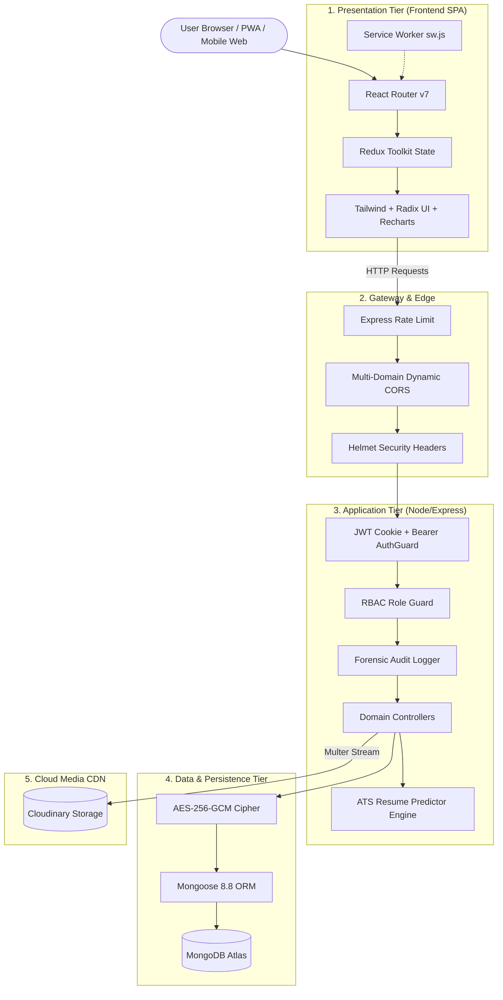

# 🏗️ Architecture Overview

ForeWork is architected as a decoupled, multi-tier MERN enterprise system with distinct client, gateway, business logic, storage, and telemetry layers.

---

## 🏛️ System Component Layers



---

## 🧩 Frontend Architecture

The frontend is a single-page application built on **React 18** and bundled with **Vite 6**:

### State Management (`Frontend/src/redux/`)
- **`authSlice.js`**: Holds authenticated user identity, JWT state, and profile meta.
- **`jobSlice.js`**: Holds searched jobs, single job detail, filter queries, saved jobs, and recruiter posted jobs.
- **`companySlice.js`**: Holds single company details and recruiter company registries.
- **`applicationSlice.js`**: Holds all applicants for recruiter review and candidate applied positions.

### Theme Engine (`Frontend/src/context/ThemeContext.jsx`)
- Supports **Light** and **Dark** mode with localStorage persistence.
- Applies class `dark` to the root document for seamless Tailwind dark mode switching.

### Code Splitting Strategy (`Frontend/vite.config.js`)
- Heavy visualization libraries are code-split into distinct chunks:
  - `vendor-charts`: Isolates Recharts and D3 dependencies.
  - `vendor-motion`: Isolates Framer Motion animations.
  - `vendor-radix`: Isolates Radix UI primitives.
  - `vendor-redux`: Isolates Redux Toolkit and React-Redux.

---

## ⚙️ Backend Architecture

The backend is an ECMAScript Module (ESM) Express application organized by domain:

### Middleware Pipeline Order (`Backend/index.js`)
1. **`helmet()`**: HTTP security headers (XSS, CSP, HSTS, Sniff) with `crossOriginResourcePolicy: "cross-origin"`.
2. **`compression()`**: Gzip payload compression (level 6, ≥1024 bytes threshold).
3. **`express.json()` & `express.urlencoded()`**: Request body parsers (10MB limit).
4. **`cookieParser()`**: Cookie extraction for token validation.
5. **`cors()`**: Multi-domain dynamic origin matching with credentials allowed and `*.vercel.app` wildcard support.
6. **Rate Limiting**: Tiered IP-based rate limiting (300 req/15min global, 15 req/15min auth, 30 req/15min apply).

### Request Flow
```
Request ➔ RateLimiter ➔ Authenticate (JWT Cookie or Bearer Token) ➔ RequireRole (RBAC) ➔ AuditLog ➔ Controller ➔ Service/Mongoose ➔ Response
```

### API Route Mounting
Routes are dual-mounted under both `/api` and `/api/v1` for versioning compatibility:
```
/api/user, /api/company, /api/job, /api/application, /api/admin, /api/notification, /api/ats
/api/v1/user, /api/v1/company, /api/v1/job, /api/v1/application, /api/v1/admin, /api/v1/notification, /api/v1/ats
```

### Multi-Domain CORS Strategy
```javascript
const frontendUrls = process.env.FRONTEND_URL
  .split(",").map(url => url.trim().replace(/\/+$/, ""));

const allowedOrigins = [
  ...frontendUrls,
  "https://forework.vercel.app",
  "https://forework-mobile.vercel.app",
  "http://localhost:5173", "http://localhost:3000", "http://localhost:8081"
];

// Dynamic: any origin ending in .vercel.app is also allowed (preview deployments)
```

### Graceful Shutdown
On `SIGTERM` or `SIGINT`, the server closes HTTP connections, drains the MongoDB connection pool, and force-terminates after a 10-second safety timeout.

---

## 🧠 ATS Engine Architecture

The ATS Resume Predictor is a standalone module under `Backend/ats/` with its own sub-architecture:

```
Backend/ats/
├── parser/              # Document ingestion (PDF, DOCX, TXT, Cloudinary URLs)
│   ├── documentExtractor.js    # In-memory stream extraction with scan detection
│   ├── resumeParser.js         # Orchestrates all extractors into normalized JSON
│   └── jdParser.js             # Job description parser (required vs preferred skills)
├── extraction/          # Entity extraction pipelines
│   ├── sectionDetector.js      # Maps headings → 10 canonical sections
│   ├── contactExtractor.js     # Name, email, phone, socials, location
│   ├── experienceExtractor.js  # Dates, action verbs, metrics, role titles
│   ├── educationExtractor.js   # Degrees, majors, GPA
│   ├── skillExtractor.js       # Taxonomy-aware skill detection
│   ├── skillTaxonomy.js        # 60+ skill aliases and synonym mappings
│   └── formattingAnalyzer.js   # Layout risk analysis (columns, tables, encoding)
├── matching/            # Skill alignment
│   ├── keywordMatcher.js       # Exact and normalized keyword overlap
│   └── semanticMatcher.js      # Conceptual similarity and cluster detection
├── scoring/
│   └── atsScoreEngine.js       # Deterministic 100-point rubric (ats_v1.0)
├── recommendations/
│   └── recommendationEngine.js # Prioritized, evidence-based action items
└── explanations/
    └── explanationEngine.js    # "Why is my score X?" natural language rationale
```

See [🎯 ATS Resume Predictor](ATS-Predictor) for detailed scoring rubric and API documentation.