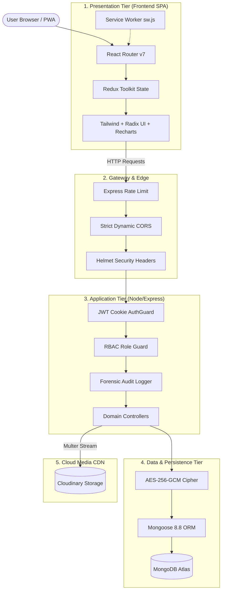

# 🏗️ Architecture Overview

ForeWork is architected as a decoupled, multi-tier MERN enterprise system with distinct client, gateway, business logic, storage, and telemetry layers.

---

## 🏛️ System Component Layers



---

## 🧩 Frontend Architecture

The frontend is a single-page application built on **React 18** and bundled with **Vite 6**:

### State Management (`Frontend/src/redux/`)
- **`authSlice.js`**: Holds authenticated user identity, JWT state, and profile meta.
- **`jobSlice.js`**: Holds searched jobs, single job detail, filter queries, saved jobs, and recruiter posted jobs.
- **`companySlice.js`**: Holds single company details and recruiter company registries.
- **`applicationSlice.js`**: Holds all applicants for recruiter review and candidate applied positions.

### Theme Engine (`Frontend/src/context/ThemeContext.jsx`)
- Supports **Light** and **Dark** mode with localStorage persistence.
- Applies class `dark` to the root document for seamless Tailwind dark mode switching.

### Code Splitting Strategy (`Frontend/vite.config.js`)
- Heavy visualization libraries are code-split into distinct chunks:
  - `vendor-charts`: Isolates Recharts and D3 dependencies.
  - `vendor-motion`: Isolates Framer Motion animations.
  - `vendor-radix`: Isolates Radix UI primitives.
  - `vendor-redux`: Isolates Redux Toolkit and React-Redux.

---

## ⚙️ Backend Architecture

The backend is an ECMAScript Module (ESM) Express application organized by domain:

### Middleware Pipeline Order (`Backend/index.js`)
1. **`express.json()` & `express.urlencoded()`**: Request body parsers.
2. **`cookieParser()`**: Cookie extraction for token validation.
3. **`cors()`**: Dynamic origin matching with credentials allowed.
4. **`helmet()`**: HTTP security headers (XSS, CSP, HSTS, Sniff).
5. **`compression()`**: Gzip payload compression.
6. **Rate Limiting**: IP-based rate limiting on sensitive endpoints.

### Request Flow
```
Request ➔ RateLimiter ➔ Authenticate (JWT) ➔ RequireRole (RBAC) ➔ AuditLog ➔ Controller ➔ Service/Mongoose ➔ Response
```