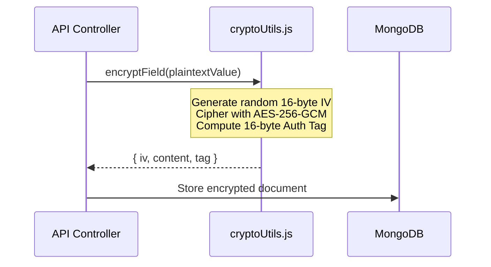
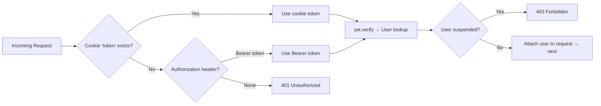

# 🔐 Security & Cryptographic Architecture

ForeWork implements a zero-trust security model protecting candidate identities, authentication credentials, and corporate data.

---

## 🛡️ AES-256-GCM Field Encryption

Sensitive personally identifiable information (PII) such as National IDs (Aadhaar, PAN) are never stored in plaintext:



- **Key Size**: 256-bit key (64 hex characters) managed via `FIELD_ENCRYPTION_KEY`.
- **Initialization Vector (IV)**: Fresh 16-byte cryptographically secure pseudo-random IV generated for every encryption operation.
- **Integrity Tag**: 16-byte authentication tag verified on decryption to prevent tampering or ciphertext manipulation.

---

## 🔍 Blind Indexing for Encrypted Queries

To allow searching and unique constraints on encrypted fields without decrypting the entire database:
- **HMAC-SHA256**: A salted hash (blind index) is computed for the sensitive field.
- The index hash is stored alongside the encrypted payload.
- Queries compare hashes instead of raw plaintext, keeping database queries fast and secure.

---

## 🍪 Authentication & Cookie Security

### JWT Cookie Authentication
- **JWT Tokens**: Signed with `JWT_SECRET` and delivered in `HttpOnly`, `SameSite: Lax/None`, `Secure` cookies.
- **Token Protection**: Inaccessible to client-side JavaScript, eliminating token theft via Cross-Site Scripting (XSS).
- **Password Hashing**: Passwords hashed with **bcrypt** using 10 salt rounds.
- **Anti-Enumeration**: Authentication endpoints return standardized failure messages to prevent email enumeration attacks.

### Bearer Token Fallback (v2.1)
To support mobile and native clients where HttpOnly cookies may not be available:
- The `isAuthenticated` middleware checks `req.cookies.token` first, then falls back to the `Authorization: Bearer <token>` header.
- This dual-source strategy enables seamless authentication across web browsers, PWA shells, and mobile web views.



### Mobile Session Extension (v2.1)
- When a client sends `X-Client: mobile` header during login, the JWT is issued with a **30-day expiry** instead of the default 1-day expiry.
- Cookie `maxAge` is correspondingly set to 30 days for mobile clients.
- The JWT token is also returned in the JSON response body (in addition to the cookie) for mobile clients that need to store it explicitly.

---

## 📸 Optional Profile Photo with Default Avatar (v2.1)

- Registration no longer requires a profile photo upload.
- If no file is provided during registration, a deterministic avatar is generated using the [UI Avatars](https://ui-avatars.com/) service with the user's name and ForeWork brand colors:
  ```
  https://ui-avatars.com/api/?name=<fullname>&background=6B3AC2&color=fff&size=256
  ```

---

## 🌐 Multi-Domain CORS Security (v2.1)

The CORS layer now supports multiple deployment origins:
- **Comma-separated `FRONTEND_URL`**: `FRONTEND_URL=https://forework.vercel.app,https://forework-mobile.vercel.app`
- **Trailing slash normalization**: Origins are cleaned with `url.trim().replace(/\/+$/, "")` before comparison.
- **Wildcard Vercel preview deployments**: Any origin ending in `.vercel.app` is automatically allowed, supporting unlimited Vercel preview URLs.
- **Hardcoded development origins**: `localhost:5173`, `localhost:3000`, `localhost:8081`.

---

## 🚦 Server Boot Security Guard

On startup, `Backend/index.js` validates all cryptographic environment variables:
- If `FIELD_ENCRYPTION_KEY` or `JWT_SECRET` is missing, empty, or using default test values in production, the server **refuses to start** and immediately terminates with an explanatory error.