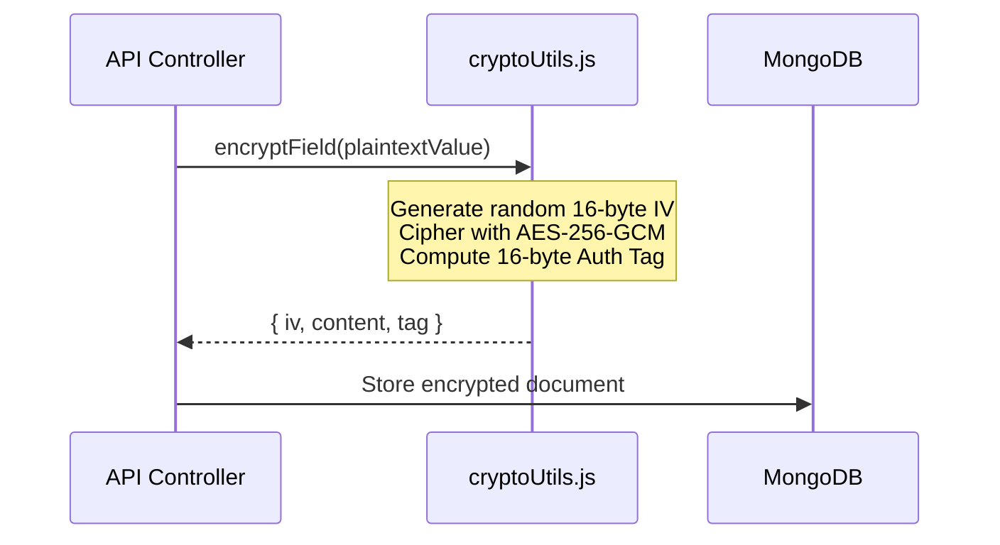

# 🔐 Security & Cryptographic Architecture

ForeWork implements a zero-trust security model protecting candidate identities, authentication credentials, and corporate data.

---

## 🛡️ AES-256-GCM Field Encryption

Sensitive personally identifiable information (PII) such as National IDs (Aadhaar, PAN) are never stored in plaintext:

- **Key Size**: 256-bit key (64 hex characters) managed via `FIELD_ENCRYPTION_KEY`.
- **Initialization Vector (IV)**: Fresh 16-byte cryptographically secure pseudo-random IV generated for every encryption operation.
- **Integrity Tag**: 16-byte authentication tag verified on decryption to prevent tampering or ciphertext manipulation.

---

## 🔍 Blind Indexing for Encrypted Queries

To allow searching and unique constraints on encrypted fields without decrypting the entire database:
- **HMAC-SHA256**: A salted hash (blind index) is computed for the sensitive field.
- The index hash is stored alongside the encrypted payload.
- Queries compare hashes instead of raw plaintext, keeping database queries fast and secure.

---

## 🍪 Authentication & Cookie Security

- **JWT Tokens**: Signed with `JWT_SECRET` and delivered in `HttpOnly`, `SameSite: Lax/None`, `Secure` cookies.
- **Token Protection**: Inaccessible to client-side JavaScript, eliminating token theft via Cross-Site Scripting (XSS).
- **Password Hashing**: Passwords hashed with **bcrypt** using 10 salt rounds.
- **Anti-Enumeration**: Authentication endpoints return standardized failure messages to prevent email enumeration attacks.

---

## 🚦 Server Boot Security Guard

On startup, `Backend/index.js` validates all cryptographic environment variables:
- If `FIELD_ENCRYPTION_KEY` or `JWT_SECRET` is missing, empty, or using default test values in production, the server **refuses to start** and immediately terminates with an explanatory error.